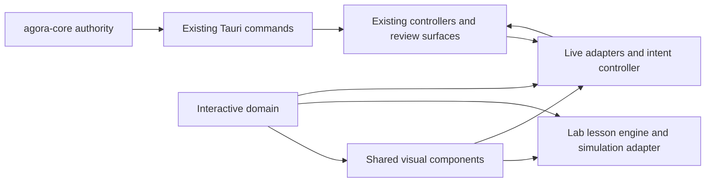

# Interactive Experiences: Master Architecture

Status: SOL-0 architecture contract

Scope: Agora Lab and High Interaction Mode

Implementation state: architecture only; no implementation is authorized by this document

Next implementation owner: DeepSeek V4 Flash

## 1. Outcome

Agora will gain two optional experiences without replacing the existing interface:

- **Agora Lab** is a safe, simulated place to learn six player-facing mental models through short interactions.
- **High Interaction Mode** is an alternate presentation of live Agora data. It can create user intent, but it cannot create a second install, launch, repair, restore, or settings system.

Standard Mode and the Field Guide remain first-class. A player must be able to leave either interactive experience at any time without converting, migrating, or losing state.

This architecture preserves the existing control plane:

- `agora-core` owns validation, plans, transactions, snapshots, health, recovery, network policy, and launch behavior.
- Tauri commands remain thin application boundaries.
- existing React controllers and review surfaces remain the authoritative route to operations;
- interactive visuals present a small player-facing model and emit intents only.

`MASTER_SPEC.md` section 19 remains authoritative if this document conflicts with older design prose.

## 2. Non-negotiable invariants

1. Lab never reads or mutates a real instance, launcher settings store, process, snapshot, credential, or network policy; its only persistence is isolated Lab progress.
2. A shared visual component never imports Tauri APIs, `desktop/src/lib/tauri.ts`, or a live controller.
3. High Interaction Mode does not duplicate backend validation or infer success from animation.
4. Current and proposed state are always distinguishable by structure, label, and assistive text—not color or motion alone.
5. Destructive or recovery-affecting actions keep serious review and confirmation surfaces.
6. Backend locks, cancellation, staleness checks, health gates, rollback, and recovery remain authoritative.
7. Every spatial interaction has a keyboard, screen-reader, reduced-motion, high-contrast, and high-text-scale equivalent.
8. The experiences teach player decisions, common mistakes, and recovery. They do not teach hashes, receipts, fingerprints, materialization, registry signatures, or loader implementation trivia.

## 3. Existing seams to preserve

| Concern | Current authoritative seam | Interactive responsibility |
|---|---|---|
| Navigation | `App.tsx`, `Sidebar.tsx`, and `useDestination.ts` | Add optional destinations/mode state without replacing typed history or app-level dialogs. |
| Guide | `Guide.tsx` and `guideContent.ts` | Deep-link to existing topics and retain Guide progress independently. |
| Appearance | `ThemeProvider`, `AppearanceSettings.tsx`, and semantic CSS tokens | Consume existing color, scale, density, contrast, and motion preferences. |
| Process state | app-level `useProcessController` | Read and render the one canonical process state; never launch from a parallel controller. |
| Install/remove/update | `InstallIntent` and `InstallFlow` backed by the canonical install pipeline | Convert gestures to `InstallIntent` and open the existing review/execute surface. |
| Health and loader repair | `HealthDialog`, `LoaderChooser`, structured health evidence, and loader plan/change commands | Visualize findings; route repair and launch choices through the existing controller/dialog. |
| Snapshots/LKG | core snapshot and LKG services plus current Tauri commands | Show player-facing recovery choices; preview and confirm before invoking the existing restore path. |
| Crash Doctor | `CrashInvestigator` and its recovery-first experiment flow | Open the existing doctor and describe hypotheses without claiming causality. |
| Java/memory | runtime inspection and core memory recommendations | Present current/recommended/proposed values; route saves through existing settings operations after review. |
| Privacy/network | backend-enforced network categories and Privacy settings | Visualize verified policy/readiness only; never infer permission or cache completeness. |

Several current components call Tauri internally. They may remain **Standard review bridges** hosted by a live controller, but they are not shared visual components.

## 4. Package structure

The implementation should be contained under `desktop/src/features/interactive/`:

```text
interactive/
  domain/
    models.ts              # minimal presentation models
    intents.ts             # closed VisualIntent union
    state.ts               # scene and proposal reducers
    guards.ts              # source/freshness/executability guards
  visual/
    primitives/            # focus, announcements, state marks, linear fallbacks
    InstanceBench.tsx
    ContentGraph.tsx
    HealthLens.tsx
    LoaderRail.tsx
    ChangeStaging.tsx
    RecoveryTimeline.tsx
    CrashEvidenceBoard.tsx
    RuntimeWorkbench.tsx
    NetworkReadinessMap.tsx
  lab/
    LabShell.tsx
    lessonEngine.ts
    scenarios/             # deterministic authored scenario data
    simulationAdapter.ts
    progressStore.ts
  live/
    LiveInteractiveHost.tsx
    readAdapters/           # backend DTO -> presentation model
    intentController.ts     # intent -> existing Standard bridge
    operationBridges/       # hosts existing review/dialog/controller seams
    freshness.ts
  testing/
    fixtures/
    scenarioContracts.ts
    adapterContracts.ts
```

Existing generic UI primitives remain in their current shared locations. Do not move established components into this feature as a drive-by refactor.

### Dependency direction



Forbidden edges are as important as allowed ones:

- `visual/`, `domain/`, and `lab/` must not import `@tauri-apps/*`, `lib/tauri`, `live/`, or current operation components.
- `simulationAdapter.ts` must not accept a real instance ID or a live callback.
- only `live/` may map backend DTOs or host Standard operation bridges.
- a visual component receives controlled data and callbacks; it never locates a service itself.

DeepSeek should add an automated import-boundary check early in the vertical slice. TypeScript types alone do not prevent a later accidental Tauri import.

## 5. Shells, modes, and coexistence

### 5.1 Agora Lab

Lab is a new top-level destination beside—not inside—the Field Guide. Its shell owns:

- adventure selection and resume;
- a clear, persistent **Simulation** label;
- lesson stage, local scenario state, and local progress;
- pause, reset, exit, and Field Guide handoffs;
- concise announcements and a non-spatial action list.

Lab must not receive the selected live instance from `App`. A link from Lab to a real destination ends the simulation first and navigates through `useDestination`; it does not carry a simulated plan into live state.

### 5.2 High Interaction Mode

High Interaction Mode is a reversible presentation preference, not a new data mode and not the existing Advanced Mode setting. It should be selectable from a clearly named appearance/interaction control and may also be offered contextually where a supported live visual exists.

For the first implementation:

- unsupported routes continue to render Standard Mode;
- supported routes offer an immediate “Use Standard view” escape;
- the selected instance and destination remain the same when switching views;
- app-level process and dialog state survive the switch;
- no data migration occurs and no operation is silently resumed or cancelled;
- Standard Mode remains the fallback if a live adapter cannot produce a safe scene.

Do not fork the whole application shell. The live host is a view inside existing navigation and receives the canonical process controller and existing operation bridges from above.

### 5.3 Persistence

Persist only two new categories:

- the user’s presentation preference (`standard` or `high-interaction`), versioned with a safe default of `standard`;
- Lab progress in a versioned, non-sensitive local record.

Lab progress records adventure ID, lesson version, completed decision checkpoints, last safe stage, and completion time. It must not contain instance IDs, paths, logs, installed-content names, account data, or live settings. A schema mismatch resets safely rather than attempting a lossy migration.

Field Guide progress and Lab progress remain separate. Completing a simulation does not mark Guide prose as read, and reading the Guide does not simulate a successful decision.

## 6. Lesson engine

The lesson engine is a deterministic reducer over authored scenario data:

```text
scenario + current stage + player decision -> next simulated scene + feedback event
```

It has no clock-dependent success condition and no external service. Animation observes reducer events; animation completion never advances the lesson. This makes reduced-motion behavior and tests equivalent to full-motion behavior.

Each checkpoint includes:

- the situation the player can see;
- the available decisions and keyboard labels;
- the expected mental model;
- a safe mistaken choice and recoverable feedback where useful;
- the success predicate;
- the Guide and real-Agora exit destinations.

Progress is earned by making or correcting a decision, not by waiting for an animation or dismissing text.

## 7. Shared visual component contract

Shared visuals are controlled views. Every component accepts:

- one of the minimal models in `DOMAIN_MODELS.md`;
- explicit `source: simulation | live` scene metadata;
- selection/focus state;
- capability flags supplied by the host;
- an `onIntent(VisualIntent)` callback;
- a linearized accessible representation or enough semantic data to build one.

They may emit selection, exploration, proposal, review, and navigation intents. They cannot emit “backend succeeded,” synthesize authoritative plans, or mutate their input models.

Recommended shared views:

| View | Player-facing question |
|---|---|
| Instance Bench | “What kind of instance am I building or inspecting?” |
| Content Graph | “What relies on what, and what would this change affect?” |
| Health Lens | “What blocks launch, what is a warning, and what is merely advice?” |
| Loader Rail | “Which loader choice is current, compatible, uncertain, or recommended?” |
| Change Staging | “What is true now, and what am I proposing?” |
| Recovery Timeline | “What safe return points exist, and what does each protect?” |
| Crash Evidence Board | “What is the current hypothesis, and what evidence would test it?” |
| Runtime Workbench | “What is Agora choosing automatically, and what would my manual change do?” |
| Network Readiness Map | “Which player-visible needs are verified for offline use?” |

## 8. Simulation and live adapters

Both adapters produce the same presentation scene, but they have deliberately different dependencies.

### Simulation adapter

- reads authored scenario fixtures only;
- uses namespaced simulated IDs;
- calculates outcomes from deterministic lesson rules;
- never imports backend DTOs or accepts operation callbacks;
- labels every scene and completion message as simulation.

### Live read adapter

- calls existing read-only wrappers through the live host;
- maps DTOs into minimal player-facing models;
- records observation time and a view revision;
- retains operation-specific authority data outside the visual model;
- degrades unknown data to `unknown` or Standard Mode instead of guessing;
- does not write, repair, launch, restore, or “test” readiness while building a scene.

The same visual component can render both sources because the model is shared. The source boundary is not shared: a discriminated scene envelope and import rules keep simulation and live authority separate.

## 9. Read-only live visualization path

The default High Interaction path is:

```text
existing read command
  -> live read adapter
  -> minimal scene with freshness metadata
  -> controlled visual component
  -> exploration/selection only
```

If a visual cannot be built from a read-only source, it is not eligible for the initial live mode.

### Offline readiness gap

Agora currently has backend-enforced network policy and cache-first launch planning, but no single read-only command that can truthfully project complete offline readiness. The live `NetworkReadinessMap` therefore requires a future core-owned, read-only query. It should report player-facing categories such as game files, loader, content, Java, and sign-in/launch-mode needs, with `ready`, `needs-attention`, or `unknown` status.

Until that query exists:

- the Lab adventure uses simulation only;
- the live map must say that full readiness has not been verified or remain unavailable;
- the UI must not inspect internal cache folders, infer completeness from registry availability, or perform a test launch as a probe.

## 10. From visual intent to an existing operation

The live mutation path is always:

```text
gesture or accessible command
  -> VisualIntent
  -> live intent controller validates source, capability, and freshness
  -> controller refreshes relevant live data
  -> existing Standard review/dialog/controller opens
  -> existing backend plan or operation validates again
  -> backend progress/result updates canonical state
  -> live adapter re-reads and renders the result
```

There is no optimistic success state. A pending proposal stays visibly proposed or busy until a confirmed backend result is followed by a successful refresh.

| Visual intent | Existing authoritative path | Required review/recovery behavior |
|---|---|---|
| Propose install, update, or removal | `InstallIntent` -> `InstallFlow` -> canonical install pipeline | Backend resolves the plan; existing dependency/conflict/file/snapshot review remains; fingerprint/stale rejection, cancellation, rollback, and health result remain. |
| Propose dependency-aware disable | Existing dependency plan and prompt | No direct toggle from the visual. Live approval is deferred to SOL-2. |
| Review health or launch | app-level `useProcessController` and `HealthDialog` | Reuse the structured scan and scan token; blockers require explicit handling/override; recommendations do not become blockers. |
| Review/change loader | existing loader plan, `LoaderChooser`, and loader change/recovery command | Proven compatibility is distinct from indeterminate; review affected content; refresh health after the backend completes. |
| Investigate a crash | existing `CrashInvestigator` | Read-only evidence first; recovery snapshot before the first experiment; restore on failed/abandoned experiment; never claim proof from one outcome. |
| Preview/restore a snapshot | existing diff/list/restore commands | Show scope and world/save boundary; serious confirmation; backend creates the pre-restore undo point and rejects active-process conflicts. |
| Propose memory/runtime settings | existing recommendation/read APIs and settings update commands | Show current, recommended, and proposed values; require summary review; backend validation and later SOL-2 approval remain necessary. |
| Stop/kill a process | app-level process controller | Preserve current stop/kill rules and stale-process handling; no graph-local process state. |

The table maps architecture only. SOL-2 must explicitly approve each real action before destructive live wiring is enabled.

## 11. Freshness, concurrency, and rejection

Every live scene has a local view revision and observation time. A live intent carries that view revision plus stable entity IDs and the player’s choice—not a backend DTO or private plan token.

Before opening an operation surface, the controller must re-read the relevant state. It then behaves as follows:

- **unchanged:** continue to the existing review flow;
- **changed but still equivalent:** update the view and ask the player to review the refreshed proposal;
- **changed in a way that invalidates intent:** reject the intent, explain what changed, and preserve selection where safe;
- **unknown or unavailable:** do not execute; offer refresh or Standard Mode.

Operation-specific tokens, plan fingerprints, and scan tokens stay inside existing live controllers and backend boundaries. They are not presentation-model fields.

Backend locks and launch reservations remain the final authority. A lock rejection clears no data and triggers a refresh. Cancellation is sent only through an existing cancellable operation and remains visually pending until acknowledged. Navigation never fabricates cancellation.

## 12. Current, proposed, pending, and committed

Interactive scenes use four explicit phases:

1. **Current** — last authoritative observation.
2. **Proposed** — a local choice that has not been accepted.
3. **In review / applying** — the existing operation surface is active or the backend is working.
4. **Committed** — the backend succeeded and the live adapter re-read the new state.

Failed, cancelled, stale, or rolled-back work returns to a refreshed current scene with a concise outcome. Motion may illustrate an accepted transition only after the corresponding event; it can never be the evidence that a transition happened.

## 13. Accessibility and performance architecture

Spatial views have one shared semantic action model. Pointer, touch, keyboard, and linear-list interactions dispatch the same intent. Graphs use roving focus or a structured list, provide relationship summaries, restore focus after refresh, and announce only material state changes.

All views must:

- reflow at Agora’s 200% text setting without clipped actions;
- preserve meaning in high contrast and without color;
- obey existing density and motion preferences;
- replace causal movement with immediate state changes and concise announcements under reduced motion;
- avoid drag-only, hover-only, or timing-dependent decisions.

Large instances should be normalized by ID, progressively disclosed, and capped in the spatial viewport. Dependency clusters may collapse, but the complete actionable set must remain available in a searchable/linear view. Do not animate layout on every progress event.

## 14. Verification architecture

DeepSeek’s vertical slice should establish these gates before scaling:

- pure reducer tests for lesson state and mistaken-choice recovery;
- scenario contract tests proving Lab has no live imports or callbacks;
- adapter fixture tests proving backend-only fields do not leak into presentation models;
- intent-controller tests proving no Tauri mutation occurs before an existing review bridge confirms it;
- component tests for keyboard parity, focus restoration, announcements, reduced motion, high contrast, and 200% text;
- regression tests retaining the existing install, health, snapshot, crash, appearance, and navigation behaviors;
- a bounded large-instance fixture for render and interaction performance.

Native smoke tests remain a separate validation layer. The first implementation should not rewrite current E2E fixtures merely to make the new architecture easier.

## 15. Implementation order and gates

DeepSeek’s first batch should build the domain boundary, import checks, Lab shell/engine, core visual primitives, and three vertical slices selected from the six adventures. It should keep live actions disabled and use live data only where a read adapter is already truthful.

Terra then evaluates learnability and perceptual causality. DeepSeek fixes ordinary implementation issues. SOL-1 reviews scaling, coupling, accessibility architecture, performance, and accidental authority paths before the remaining Lab adventures proceed.

No destructive live integration is authorized until SOL-2.

## SOL-0 mandatory handoff

```text
Agent: Sol
Phase: SOL-0 architecture reconnaissance
Commit / branch / dirty status: master tracking origin/master; uncommitted documentation-only changes under docs/interactive
Files changed: docs/interactive/MASTER_ARCHITECTURE.md, DOMAIN_MODELS.md, VISUAL_LANGUAGE.md, LESSON_MAP.md, SAFETY_BOUNDARIES.md
Tests run: SOL-0 document/Guide-topic contract check; source-seam symbol check; per-file git diff --no-index --check; no product tests because this phase changes no product code
How to launch/test: no launch is required; review the five documents together, then use the existing desktop commands when DeepSeek begins the vertical slice
Known failures: live aggregate offline-readiness projection does not exist; live destructive integrations are intentionally not approved
Decisions made: one minimal presentation domain; compile/test-enforced simulation boundary; optional High Interaction presentation; gestures route through existing Standard operation bridges; current/proposed/freshness/accessibility contracts
Decisions explicitly not made: final visual styling or lesson copy; which three vertical slices DeepSeek chooses; implementation of the offline-readiness query; approval of any destructive live action; changes to existing backend DTOs
Required next agent: DeepSeek V4 Flash
Why work is stopping: the SOL-0 plan has a hard stop after architecture documents and explicitly assigns implementation to DeepSeek
```
